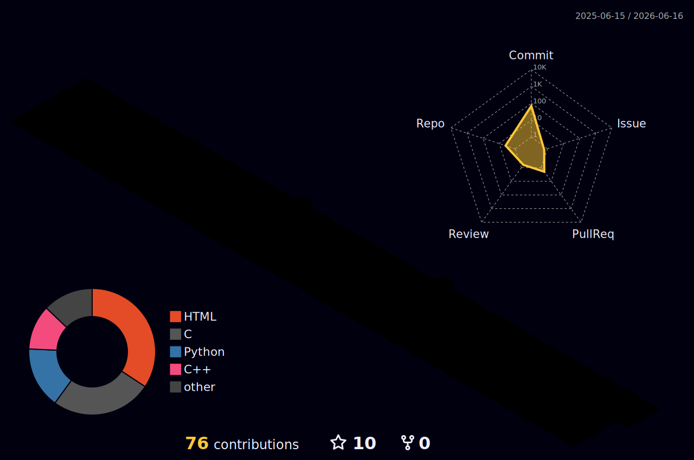

# Hi, I'm Li Wenjun 李文俊 👋

<picture>
  <source media="(prefers-color-scheme: dark)" srcset="assets/images/lofi-night.gif" />
  <source media="(prefers-color-scheme: light)" srcset="assets/images/Solitary.gif" />
  
</picture>

## 🧑‍💻 About Me · 关于我

- 🤖 Focus: **Embodied AI** · 具身智能
- 🎓 CS undergraduate @ Shenzhen University · 深圳大学
- 🔬 Into deep learning, robotics & agents that act in the real world
- ⚡ Coding for fun, building for real · 写代码图开心,做东西要落地

## 🛠️ Tech Stack · 技能栈

<table align="center">
  <tr>
    <td align="right"><b>Languages</b></td>
    <td>
      
      
      
    </td>
  </tr>
  <tr>
    <td align="right"><b>AI / ML</b></td>
    <td>
      
      
    </td>
  </tr>
  <tr>
    <td align="right"><b>Tools</b></td>
    <td>
      
      
    </td>
  </tr>
</table>

## 📊 GitHub

<!-- Snake Animation -->
<picture>
  <source media="(prefers-color-scheme: dark)" srcset="profile-snake-contrib/github-contribution-grid-snake-dark.svg" />
  <source media="(prefers-color-scheme: light)" srcset="profile-snake-contrib/github-contribution-grid-snake.svg" />
  
</picture>

<!-- 3D Contribution Graph -->
<picture>
  <source media="(prefers-color-scheme: dark)" srcset="profile-3d-contrib/profile-night-rainbow.svg" />
  <source media="(prefers-color-scheme: light)" srcset="profile-3d-contrib/profile-green-animate.svg" />
  
</picture>

  

